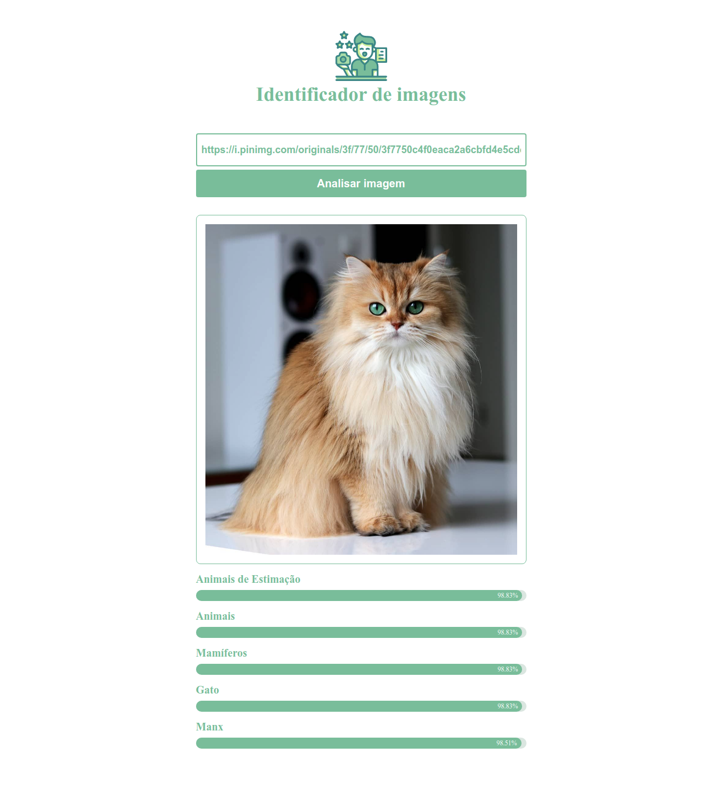

# Analyze Image
Serverless application to analyze images with AWS Rekognition
<div align="center">
  
</div>


## Setup and Run
See how to configure the serverless API and Front End (in React.js)

#### Serverless API
- Create an AWS account
- Add a user with admin permissions ( Download the CSV file with the user data that was created)
- Open CSV File
- Install AWS-CLI (example for [linux](https://docs.aws.amazon.com/pt_br/cli/latest/userguide/install-linux-al2017.html))
- Run `aws configure` in the terminal
- When running the command above, it will require some information:
  ```
  AWS Access Key ID: <Access Key Id of CSV file> 
  AWS Secret Access Key: <Secret Access Key of CSV file> 
  Default region name: us-east-1
  Default output format: json
  ```
- Install serverless framework (`npm i -g serverless`)
- Open the `api-serverless` directory
- Install the dependencies (run `npm i`)
- To deploy, run `serverless deploy` or `sls deploy` (alias)
- And copy the link (endpoint) of the project that was generated in the deploy

#### Frontend
- Open the `frontend` directory
- Open the `src/config/api.js` file
- Change the `API_URL` to the value generated in `api-serverless`
- Install the dependencies (run `npm i`)
- Run `npm start`
